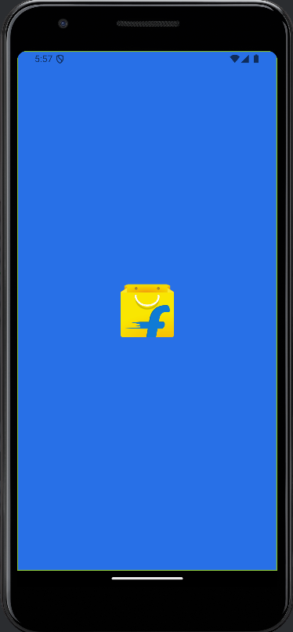
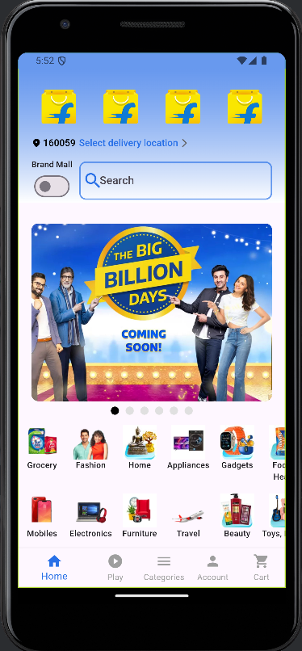
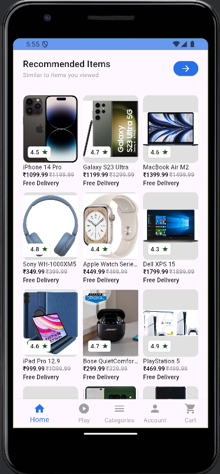
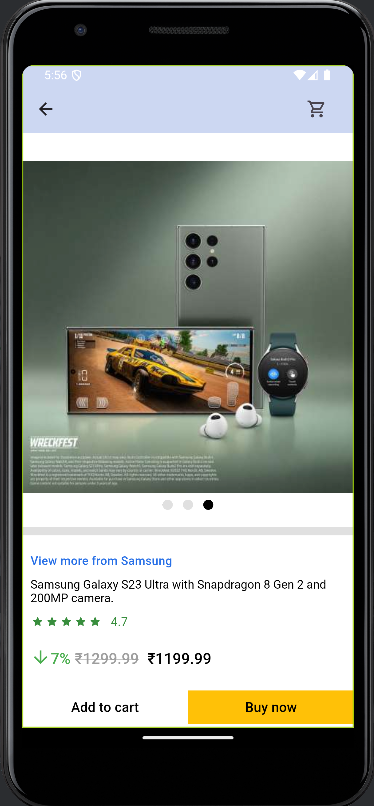
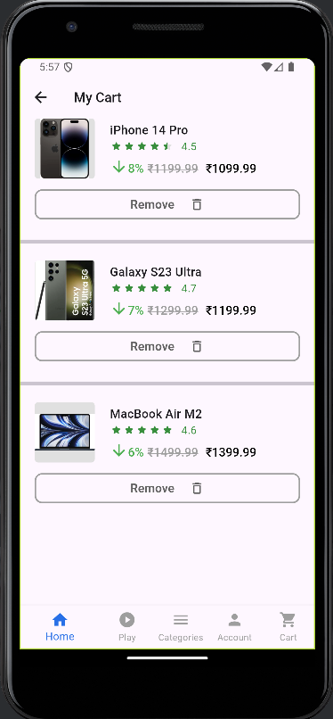

# 📱 Flipkart Clone 🛒

A Flutter-based clone of the Flipkart app with essential shopping features such as viewing product details, adding/removing items from the cart, and offline storage using Hive. The project uses the BLoC pattern for state management. 🚀

---

## 🌟 Features

- **Splash Screen**: A splash screen that appears on app startup. 🖥️
- **Home Screen**: Displays a list of products fetched from a local JSON file. 🏠
- **Product Detail Screen**: Allows users to view more details about a selected product. 🛍️
- **Cart Screen**: Users can view and remove products from their cart. 🛒
- **Offline Cart Storage**: Cart items are saved locally using Hive, so they persist even after the app is closed. 💾
- **BLoC State Management**: Efficient state management using the BLoC pattern. 🧠

---

## 📸 Screenshots

### 1. **Splash Screen**
  
_This is the splash screen shown when the app starts._ 🎬

---

### 2. **Home Screen**
    
_The home screen displays a list of available products fetched from assets._ 🛒

---

### 3. **Product Detail Screen**
  
_The product detail screen provides detailed information about a product and an option to add it to the cart._ 📦

---

### 4. **Cart Screen**
  
_The cart screen displays the items added to the cart with options to remove products._ 🛍️❌

---

## 🚀 Installation

1. **Clone the repository:**
   ```bash
   git clone https://github.com/yourusername/flutter-flipkart-clone.git
   ```

2. **Navigate to the project directory:**
   ```bash
   cd flutter-flipkart-clone
   ```

3. **Install dependencies:**
   ```bash
   flutter pub get
   ```

4. **Run the app:**
   ```bash
   flutter run
   ```

---

## 🛠️ Technologies Used

- **Flutter**: Framework for building cross-platform mobile applications. 🖥️📱
- **BLoC (Business Logic Component)**: A state management pattern for separating business logic from UI. 🧠
- **Hive**: A lightweight and fast key-value database for storing cart data offline. 💾
- **JSON**: Used to store product data in assets. 📄

---

## 🧑‍💻 How It Works

1. **Splash Screen**: Appears for a few seconds when the app starts. ⏳
2. **Home Screen**: Displays a list of products fetched from a local JSON file located in `assets/products/products_data.json`. 🛍️
3. **Product Detail Screen**: On tapping a product from the home screen, the user is taken to the product detail screen where they can view detailed information and add the product to the cart. 📦➡️🛒
4. **Cart Screen**: Displays the products added to the cart with options to remove items. The cart persists even after the app is closed, thanks to Hive. 💾
5. **Offline Cart Storage**: Cart data persists even if the app is closed, thanks to the Hive database. 📲

---

## 💡 State Management with BLoC

- **Cart BLoC**: Manages cart state and updates the local Hive database when items are added or removed. 🛒🔄
- **Product BLoC**: Manages the product list state and provides data to the UI. 🏷️

---

## 📦 Offline Storage with Hive

- Cart data is stored in Hive, ensuring that users' cart information is retained across app launches, even when offline. 💾🔒

---
